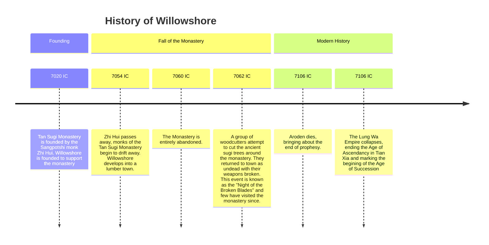

> [!info]+ Settlement Details
> **Type:** Town
> **Region:** [[Shenmen|Shenmen]]
> **Leadership:** [[1. World Almanac/NPCs/Willowshore Citizens/Heh Shan-Bao.md|Heh Shan-Bao]]
> **Population:** 225

```base
filters:
  and:
    - file.path.startsWith("1. World Almanac/Locations/Settlements/Willowshore Locations")
views:
  - type: leaflet-map
    name: Willowshore-Map
    mapName: test
    image: z_assets/Maps/Willowshore.webp
    height: 400
    minZoom: -4
    maxZoom: 2
    defaultZoom: -3
    zoomDelta: 1
    scale: "1.5"
    unit: feet
  - type: table
    name: List

```

## Description

Willowshore

## Key Establishments

## Notable Residents


